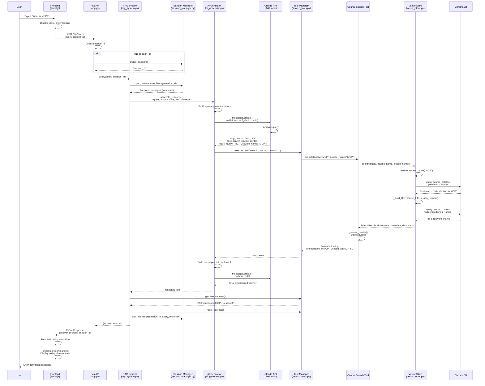

# Query Flow Architecture

## Complete User Query Flow: Frontend → Backend → Response

This document traces the end-to-end journey of a user query through the Course Materials RAG System.

---

## Flow Diagram (Mermaid)



---

## Detailed Step-by-Step Flow

### 1. Frontend: User Input (`frontend/script.js`)

**User Action:**
```javascript
User types: "What is MCP?"
```

**Script.js Flow** (Lines 45-96):
```javascript
sendMessage()
├─ Disable input fields
├─ Add user message to UI (line 55)
├─ Show loading animation (lines 58-60)
└─ POST to /api/query
   {
     query: "What is MCP?",
     session_id: currentSessionId  // null for first query
   }
```

**Key Code:**
```javascript
const response = await fetch(`${API_URL}/query`, {
    method: 'POST',
    headers: {'Content-Type': 'application/json'},
    body: JSON.stringify({
        query: query,
        session_id: currentSessionId
    })
});
```

---

### 2. Backend: API Endpoint (`backend/app.py`)

**FastAPI Endpoint** (Lines 56-74):
```python
@app.post("/api/query")
async def query_documents(request: QueryRequest):
    # Step 1: Session handling
    session_id = request.session_id
    if not session_id:
        session_id = rag_system.session_manager.create_session()
        # → Creates "session_1"

    # Step 2: Process query through RAG system
    answer, sources = rag_system.query(request.query, session_id)

    # Step 3: Return response
    return QueryResponse(
        answer=answer,
        sources=sources,
        session_id=session_id
    )
```

**Response Model:**
- `answer` - AI-generated response text
- `sources` - List of source citations (e.g., ["Course Title - Lesson 0"])
- `session_id` - Session identifier for conversation continuity

---

### 3. RAG System Orchestration (`backend/rag_system.py`)

**rag_system.query()** (Lines 102-140):
```python
def query(query: str, session_id: str) -> Tuple[str, List[str]]:
    # Step 1: Build prompt
    prompt = f"Answer this question about course materials: {query}"

    # Step 2: Get conversation history
    history = self.session_manager.get_conversation_history(session_id)
    # → Returns: "User: previous question\nAssistant: previous answer"

    # Step 3: Generate AI response with tools
    response = self.ai_generator.generate_response(
        query=prompt,
        conversation_history=history,
        tools=self.tool_manager.get_tool_definitions(),
        tool_manager=self.tool_manager
    )

    # Step 4: Extract sources from tool execution
    sources = self.tool_manager.get_last_sources()
    self.tool_manager.reset_sources()

    # Step 5: Update conversation history
    self.session_manager.add_exchange(session_id, query, response)

    return response, sources
```

**Key Responsibilities:**
- Coordinates all components
- Manages conversation context
- Extracts sources from tool execution
- Maintains session history

---

### 4. Session Management (`backend/session_manager.py`)

**SessionManager.get_conversation_history()** (Lines 42-56):
```python
def get_conversation_history(session_id: str) -> Optional[str]:
    if not session_id or session_id not in self.sessions:
        return None

    messages = self.sessions[session_id]
    if not messages:
        return None

    # Format messages for context
    formatted_messages = []
    for msg in messages:
        formatted_messages.append(f"{msg.role.title()}: {msg.content}")

    return "\n".join(formatted_messages)
```

**Features:**
- Stores up to `max_history * 2` messages (default: 10 messages = 5 exchanges)
- Formats as simple text: "User: question\nAssistant: answer"
- Lazy session creation (only when needed)

---

### 5. AI Generation with Claude (`backend/ai_generator.py`)

**ai_generator.generate_response()** (Lines 43-87):

```python
def generate_response(query, conversation_history, tools, tool_manager):
    # Step 1: Build system prompt with history
    system_content = SYSTEM_PROMPT
    if conversation_history:
        system_content += f"\n\nPrevious conversation:\n{conversation_history}"

    # Step 2: Prepare API call
    api_params = {
        "model": "claude-sonnet-4-20250514",
        "temperature": 0,
        "max_tokens": 800,
        "messages": [{"role": "user", "content": query}],
        "system": system_content,
        "tools": tools,  # ← Search tool definition
        "tool_choice": {"type": "auto"}
    }

    # Step 3: Call Claude API
    response = self.client.messages.create(**api_params)

    # Step 4: Check if Claude wants to use tools
    if response.stop_reason == "tool_use":
        return self._handle_tool_execution(response, api_params, tool_manager)

    # Direct answer (no tool needed)
    return response.content[0].text
```

**Claude's Decision Process:**
- **Course-specific query** → Uses `search_course_content` tool
- **General knowledge** → Returns direct answer
- **Ambiguous** → Decides based on context

**System Prompt Key Points:**
```python
SYSTEM_PROMPT = """
You are an AI assistant specialized in course materials...

Search Tool Usage:
- Use the search tool **only** for specific course content questions
- **One search per query maximum**
- Synthesize results into fact-based responses

Response Protocol:
- General knowledge: Answer without searching
- Course-specific: Search first, then answer
- No meta-commentary about search process
"""
```

---

### 6. Tool Execution (`backend/ai_generator.py:89-135`)

**_handle_tool_execution()** flow:
```python
def _handle_tool_execution(initial_response, base_params, tool_manager):
    # Step 1: Extract tool calls from Claude's response
    messages = base_params["messages"].copy()
    messages.append({"role": "assistant", "content": initial_response.content})

    # Step 2: Execute all tool calls
    tool_results = []
    for content_block in initial_response.content:
        if content_block.type == "tool_use":
            # Execute the tool
            tool_result = tool_manager.execute_tool(
                content_block.name,  # "search_course_content"
                **content_block.input  # {query: "MCP", course_name: "MCP"}
            )

            tool_results.append({
                "type": "tool_result",
                "tool_use_id": content_block.id,
                "content": tool_result  # Formatted search results
            })

    # Step 3: Send results back to Claude
    messages.append({"role": "user", "content": tool_results})

    # Step 4: Get final answer from Claude
    final_params = {
        **self.base_params,
        "messages": messages,
        "system": base_params["system"]
    }

    final_response = self.client.messages.create(**final_params)
    return final_response.content[0].text
```

**Two-Step AI Interaction:**
1. **Initial call** - Claude decides if search is needed
2. **Follow-up call** - Claude synthesizes final answer from search results

---

### 7. Course Search Tool (`backend/search_tools.py`)

**Tool Definition** (Lines 27-50):
```python
{
    "name": "search_course_content",
    "description": "Search course materials with smart course name matching",
    "input_schema": {
        "type": "object",
        "properties": {
            "query": {
                "type": "string",
                "description": "What to search for in course content"
            },
            "course_name": {
                "type": "string",
                "description": "Course title (partial matches work)"
            },
            "lesson_number": {
                "type": "integer",
                "description": "Specific lesson number to search"
            }
        },
        "required": ["query"]
    }
}
```

**CourseSearchTool.execute()** (Lines 52-86):
```python
def execute(query: str, course_name: Optional[str] = None,
            lesson_number: Optional[int] = None) -> str:
    # Step 1: Call vector store's search interface
    results = self.store.search(
        query=query,
        course_name=course_name,
        lesson_number=lesson_number
    )

    # Step 2: Handle errors or empty results
    if results.error:
        return results.error
    if results.is_empty():
        filter_info = ""
        if course_name:
            filter_info += f" in course '{course_name}'"
        if lesson_number:
            filter_info += f" in lesson {lesson_number}"
        return f"No relevant content found{filter_info}."

    # Step 3: Format results
    return self._format_results(results)
```

**_format_results()** (Lines 88-114):
```python
def _format_results(results: SearchResults) -> str:
    formatted = []
    sources = []

    for doc, meta in zip(results.documents, results.metadata):
        course_title = meta.get('course_title', 'unknown')
        lesson_num = meta.get('lesson_number')

        # Build context header
        header = f"[{course_title}"
        if lesson_num is not None:
            header += f" - Lesson {lesson_num}"
        header += "]"

        # Track source for UI
        source = course_title
        if lesson_num is not None:
            source += f" - Lesson {lesson_num}"
        sources.append(source)

        formatted.append(f"{header}\n{doc}")

    # Store sources for retrieval
    self.last_sources = sources

    return "\n\n".join(formatted)
```

**Example Output:**
```
[Introduction to MCP - Lesson 0]
MCP (Model Context Protocol) is a protocol that enables applications
to provide context to LLMs in a standardized way...

[Introduction to MCP - Lesson 1]
MCP Servers are processes that expose specific capabilities through
the Model Context Protocol...
```

---

### 8. Vector Store Search (`backend/vector_store.py`)

**VectorStore.search()** (Lines 61-100):
```python
def search(query: str, course_name: Optional[str] = None,
           lesson_number: Optional[int] = None,
           limit: Optional[int] = None) -> SearchResults:
    # Step 1: Resolve course name to exact title (fuzzy matching)
    course_title = None
    if course_name:
        course_title = self._resolve_course_name(course_name)
        if not course_title:
            return SearchResults.empty(f"No course found matching '{course_name}'")

    # Step 2: Build filter for content search
    filter_dict = self._build_filter(course_title, lesson_number)

    # Step 3: Search course content with embeddings
    search_limit = limit if limit is not None else self.max_results

    try:
        results = self.course_content.query(
            query_texts=[query],
            n_results=search_limit,
            where=filter_dict
        )
        return SearchResults.from_chroma(results)
    except Exception as e:
        return SearchResults.empty(f"Search error: {str(e)}")
```

**_resolve_course_name()** (Lines 102-116):
```python
def _resolve_course_name(course_name: str) -> Optional[str]:
    """Use vector search to find best matching course by name"""
    try:
        # Semantic search in course_catalog collection
        results = self.course_catalog.query(
            query_texts=[course_name],
            n_results=1
        )

        if results['documents'][0] and results['metadatas'][0]:
            # Return the exact title
            return results['metadatas'][0][0]['title']
    except Exception as e:
        print(f"Error resolving course name: {e}")

    return None
```

**Key Features:**
- **Fuzzy Course Matching**: "MCP" → "Introduction to MCP" via semantic search
- **Metadata Filtering**: Filter by course title and/or lesson number
- **Configurable Results**: Default top-5, configurable limit
- **Two Collections**:
  - `course_catalog` - Course metadata for name resolution
  - `course_content` - Actual content chunks for semantic search

---

### 9. ChromaDB Under the Hood

**Embedding Process:**
```python
# 1. Query text converted to embedding vector
embedding = SentenceTransformer('all-MiniLM-L6-v2').encode("MCP")
# → 768-dimensional vector: [0.123, -0.456, 0.789, ...]

# 2. Cosine similarity computed with all stored chunks
similarity_scores = cosine_similarity(query_embedding, chunk_embeddings)

# 3. Top-N most similar chunks returned
# 4. Metadata filters applied (course_title, lesson_number)
```

**Search Parameters:**
- `query_texts` - Input query to search
- `n_results` - Number of results to return (default: 5)
- `where` - Metadata filters (e.g., `{"course_title": "Introduction to MCP"}`)

**Collections:**
```python
# course_catalog - Course metadata
{
    "id": "Introduction to MCP",
    "document": "Introduction to MCP",  # For semantic search
    "metadata": {
        "title": "Introduction to MCP",
        "instructor": "Dr. Smith",
        "course_link": "https://...",
        "lessons_json": "[{...}]",
        "lesson_count": 5
    }
}

# course_content - Content chunks
{
    "id": "Introduction_to_MCP_0",
    "document": "Course Introduction to MCP Lesson 0 content: MCP is...",
    "metadata": {
        "course_title": "Introduction to MCP",
        "lesson_number": 0,
        "chunk_index": 0
    }
}
```

---

### 10. Response Assembly & Return

**Path back through the stack:**

```
ChromaDB → SearchResults
  ↓
VectorStore → SearchResults object
  ↓
CourseSearchTool → Formatted string + sources stored in last_sources
  ↓
ToolManager → Executes tool, stores results
  ↓
AI Generator → Tool result sent to Claude → Final synthesized answer
  ↓
RAG System → Gets sources from tool_manager.get_last_sources()
  ↓
FastAPI → QueryResponse JSON
  ↓
Frontend → Displays answer + sources
```

**Final API Response:**
```json
{
  "answer": "MCP (Model Context Protocol) is a protocol that enables applications to provide context to LLMs in a standardized way. It allows different tools and data sources to expose their capabilities to AI applications through a unified interface...",
  "sources": [
    "Introduction to MCP - Lesson 0",
    "Introduction to MCP - Lesson 1"
  ],
  "session_id": "session_1"
}
```

---

### 11. Frontend Display (`frontend/script.js`)

**Display Logic** (Lines 74-85, 113-138):
```javascript
// Parse response
const data = await response.json();

// Update session ID
if (!currentSessionId) {
    currentSessionId = data.session_id;
}

// Remove loading animation
loadingMessage.remove();

// Add AI response with markdown rendering
addMessage(data.answer, 'assistant', data.sources);
```

**addMessage() Function:**
```javascript
function addMessage(content, type, sources = null) {
    const messageDiv = document.createElement('div');
    messageDiv.className = `message ${type}`;

    // Convert markdown to HTML for assistant messages
    const displayContent = type === 'assistant'
        ? marked.parse(content)  // Markdown rendering
        : escapeHtml(content);

    let html = `<div class="message-content">${displayContent}</div>`;

    // Add collapsible sources section
    if (sources && sources.length > 0) {
        html += `
            <details class="sources-collapsible">
                <summary class="sources-header">Sources</summary>
                <div class="sources-content">${sources.join(', ')}</div>
            </details>
        `;
    }

    messageDiv.innerHTML = html;
    chatMessages.appendChild(messageDiv);
    chatMessages.scrollTop = chatMessages.scrollHeight;
}
```

**UI Output:**
```
┌────────────────────────────────────────────┐
│ User: What is MCP?                         │
├────────────────────────────────────────────┤
│ Assistant:                                 │
│ MCP (Model Context Protocol) is a         │
│ protocol that enables applications to     │
│ provide context to LLMs in a standardized │
│ way...                                     │
│                                            │
│ ▼ Sources                                  │
│   Introduction to MCP - Lesson 0,          │
│   Introduction to MCP - Lesson 1           │
└────────────────────────────────────────────┘
```

---

## Architecture Summary

### Key Components

| Component | File | Responsibility |
|-----------|------|----------------|
| **Frontend** | `frontend/script.js` | User interface, API communication |
| **API Layer** | `backend/app.py` | HTTP endpoints, request routing |
| **RAG Orchestrator** | `backend/rag_system.py` | Coordinates all components |
| **Session Manager** | `backend/session_manager.py` | Conversation history |
| **AI Generator** | `backend/ai_generator.py` | Claude API integration, tool handling |
| **Tool Manager** | `backend/search_tools.py` | Tool registration and execution |
| **Vector Store** | `backend/vector_store.py` | Semantic search, ChromaDB interface |
| **Document Processor** | `backend/document_processor.py` | Parse and chunk documents |

### Data Flow Characteristics

1. **Lazy Session Creation** - Session only created on first query
2. **Conversation Context** - Previous exchanges included in system prompt
3. **Smart Tool Usage** - Claude autonomously decides when to search
4. **Fuzzy Course Matching** - Vector search resolves partial names
5. **Semantic Search** - Content retrieved by meaning, not keywords
6. **Two-Step AI Call** - Tool decision → execution → synthesis
7. **Source Tracking** - Search results captured for UI display
8. **Stateless API** - Each request contains necessary context

### Technology Stack

| Layer | Technology | Purpose |
|-------|-----------|---------|
| **Frontend** | Vanilla JavaScript + marked.js | UI and markdown rendering |
| **API** | FastAPI + Uvicorn | REST API server |
| **AI** | Anthropic Claude Sonnet 4 | Natural language understanding |
| **Embeddings** | SentenceTransformer (all-MiniLM-L6-v2) | Text vectorization |
| **Vector DB** | ChromaDB | Semantic search and storage |
| **Session** | In-memory Python dict | Conversation management |

---

## Performance Considerations

### Optimization Points

1. **Embedding Caching** - ChromaDB caches embeddings, avoiding recomputation
2. **Static System Prompt** - Built once, reused across calls
3. **Base API Parameters** - Pre-built to avoid repeated construction
4. **Limited History** - Only last N exchanges kept (default: 5)
5. **Sentence-Aware Chunking** - Preserves semantic coherence
6. **Max Results Limit** - Default 5 chunks to control context size
7. **Connection Pooling** - ChromaDB persistent client reused

### Bottlenecks

1. **Claude API Calls** - Network latency (200-500ms per call)
2. **Two API Calls for Tool Use** - Doubles latency for course queries
3. **Embedding Generation** - 768-dim vectors for each query
4. **ChromaDB Query** - Cosine similarity across all chunks

---

## Error Handling

### Failure Points & Handling

| Point | Error Type | Handling |
|-------|-----------|----------|
| **Frontend → API** | Network failure | Display error message to user |
| **Session Creation** | None expected | Fallback to null session |
| **Claude API** | API error, timeout | Raise HTTPException 500 |
| **Tool Execution** | Search error | Return error message to Claude |
| **Course Resolution** | No match found | Return "No course found matching..." |
| **Vector Search** | ChromaDB error | Return SearchResults.empty() |
| **Empty Results** | No relevant content | Return "No relevant content found..." |

---

## Security & Configuration

### API Keys
- `ANTHROPIC_API_KEY` - Required in `.env` file
- Loaded via `python-dotenv`

### CORS Configuration
```python
app.add_middleware(
    CORSMiddleware,
    allow_origins=["*"],  # Open for development
    allow_credentials=True,
    allow_methods=["*"],
    allow_headers=["*"]
)
```

### Trusted Hosts
```python
app.add_middleware(
    TrustedHostMiddleware,
    allowed_hosts=["*"]  # Open for development
)
```

---

## File References

### Frontend
- `frontend/script.js:45-96` - sendMessage() function
- `frontend/script.js:113-138` - addMessage() function
- `frontend/index.html` - UI structure

### Backend
- `backend/app.py:56-74` - /api/query endpoint
- `backend/rag_system.py:102-140` - query() orchestration
- `backend/ai_generator.py:43-87` - generate_response()
- `backend/ai_generator.py:89-135` - _handle_tool_execution()
- `backend/search_tools.py:52-86` - CourseSearchTool.execute()
- `backend/vector_store.py:61-100` - VectorStore.search()
- `backend/session_manager.py:42-56` - get_conversation_history()

---

## Example Query Scenarios

### Scenario 1: Course-Specific Question
```
Query: "What is MCP?"
→ Claude uses search tool
→ Searches course content for "MCP"
→ Finds relevant chunks from "Introduction to MCP"
→ Returns synthesized answer with sources
```

### Scenario 2: General Knowledge Question
```
Query: "What is machine learning?"
→ Claude answers directly (no search needed)
→ Uses built-in knowledge
→ Returns answer, no sources
```

### Scenario 3: Specific Lesson Question
```
Query: "Tell me about lesson 2 in the MCP course"
→ Claude uses search tool with filters
→ course_name: "MCP", lesson_number: 2
→ Returns only lesson 2 content
→ Sources: "Introduction to MCP - Lesson 2"
```

### Scenario 4: Multi-Turn Conversation
```
Turn 1: "What is MCP?"
→ Search, answer, store in session_1

Turn 2: "How do I use it?" (same session)
→ Previous context included in system prompt
→ Claude understands "it" refers to MCP
→ May search again or answer from context
```

---

## Conclusion

This RAG system implements a sophisticated query processing pipeline that:

✓ **Intelligently routes queries** - Claude decides when to search
✓ **Maintains conversation context** - Session-based history
✓ **Performs semantic search** - Vector embeddings for relevance
✓ **Provides source attribution** - Tracks where answers come from
✓ **Handles fuzzy matching** - Resolves partial course names
✓ **Scales efficiently** - Optimized for real-time responses

The architecture demonstrates best practices for building production-ready RAG applications with tool-calling capabilities.
